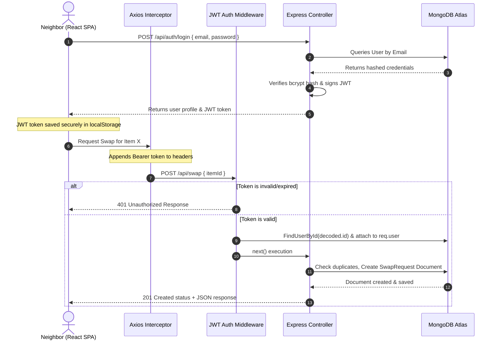

# 🌿 SwapNShare

A sustainable, community-driven marketplace built with the **MERN** stack. SwapNShare empowers local neighborhoods to reduce waste, list surplus items, and seamlessly coordinate peer-to-peer swaps—all packaged in a stunning, modern **Glassmorphism** interface.

---

## ⚡ Tech Stack & Badges

[-blue?style=for-the-badge&logo=react&logoColor=61DAFB)](https://react.dev/)
[-green?style=for-the-badge&logo=node.js&logoColor=339933)](https://nodejs.org/)
[](https://www.mongodb.com/)
[](https://jwt.io/)
[](#styling)

---

## ✨ Key Features

*   **🎨 Premium Glassmorphism UI & Dark Mode**: A gorgeous, state-of-the-art responsive interface featuring frosted glass cards, dynamic realistic category imagery, and a seamless toggle for an immersive **Dark Theme**.
*   **👤 Comprehensive Profile Management**: Users can manage their personal details (Name, Email, Mobile Number, City Location) and securely change their passwords through an interactive Profile Modal.
*   **🔒 Secure Authentication**: Sign up and login workflows powered by salted and hashed passwords using `bcryptjs`, generating cryptographically signed `JWT` tokens.
*   **🛒 Neighborhood Marketplace**: A real-time dashboard displaying available goods. Items automatically display realistic, context-aware thumbnails based on their category (e.g., Electronics, Groceries, Appliances, Furniture).
*   **🤝 Interactive Swap Workflow**:
    *   Initiate peer-to-peer swap requests.
    *   Built-in logic preventing duplicate requests or requesting your own item.
    *   Dedicated dashboard for managing incoming and outgoing requests (Accept/Reject options).

---

## 🏛️ System Architecture

The project leverages a decoupled client-server architecture with state management and authentication hooks. Below is the workflow demonstrating a typical request cycle:



---

## 🗃️ Database Schema & Relationships

### 1. `User` Schema
Represents the application’s registered users.

| Field | Type | Rules / Validations | Description |
| :--- | :--- | :--- | :--- |
| `_id` | ObjectId | Auto-generated | Primary Key |
| `name` | String | Required (trimmed) | User's full name |
| `email` | String | Required, Unique | Unique login email |
| `mobileNumber` | String | Optional | User's contact number |
| `location.city`| String | Optional | User's city for neighborhood matching |
| `password` | String | Required, Min length: 6 | Hashed password credential |

### 2. `Item` Schema
Represents items listed by users for exchange.

| Field | Type | Rules / Validations | Description |
| :--- | :--- | :--- | :--- |
| `_id` | ObjectId | Auto-generated | Primary Key |
| `title` | String | Required (trimmed) | Item name / title |
| `description`| String | Required (trimmed) | Details, expiry status, or conditions |
| `owner` | ObjectId | Required, `ref: 'User'` | Foreign Key referring to the creator |

### 3. `SwapRequest` Schema
Represents exchange transactions between two neighbors.

| Field | Type | Rules / Validations | Description |
| :--- | :--- | :--- | :--- |
| `fromUser` | ObjectId | Required, `ref: 'User'` | Neighbor proposing the swap |
| `toUser` | ObjectId | Required, `ref: 'User'` | Neighbor who owns the listing |
| `itemId` | ObjectId | Required, `ref: 'Item'` | Listing being requested |
| `status` | String | Enum: `['pending', 'accepted', 'rejected']` | Request status |

---

## 🚀 Local Development Setup

### Prerequisites
- Install [Node.js](https://nodejs.org) (v18+).
- Have a running [MongoDB Atlas Database](https://mongodb.com/atlas) or a local MongoDB server.

### Step 1 — Configure Environment Settings
Inside `server/`, create a `.env` file:
```env
PORT=5000
MONGO_URI=mongodb+srv://<username>:<password>@cluster.xxxx.mongodb.net/swapnshare?retryWrites=true&w=majority
JWT_SECRET=your_super_secret_jwt_key
```

### Step 2 — Run Backend Server
```bash
cd server
npm install
npm run dev
```

### Step 3 — Run React Frontend
Open a **new terminal window**:
```bash
cd client
npm install
npm run dev
```
Open [http://localhost:5173](http://localhost:5173) in your browser.

---

## 🛠️ Design Patterns & Security Principles

*   **Separation of Concerns (MVC Structure)**: Controllers handle application logic, models validate data constraints, and routes define exposure points.
*   **Axios HTTP Interceptors**: Frontend calls use custom Axios instances that intercept outgoing queries, automatically inject JWT bearer tokens from client local storage.
*   **Middleware-Driven Route Protection**: Route access control is delegated to a decoupled `authMiddleware`.
*   **Input Validation & Security Guardrails**: Mongoose schemas reject malformed strings. Passwords are encrypted utilizing **bcryptjs**.

---

## 📄 License & Contact

Distributed under the MIT License. Developed with 💚 for sustainable neighborhood sharing.
