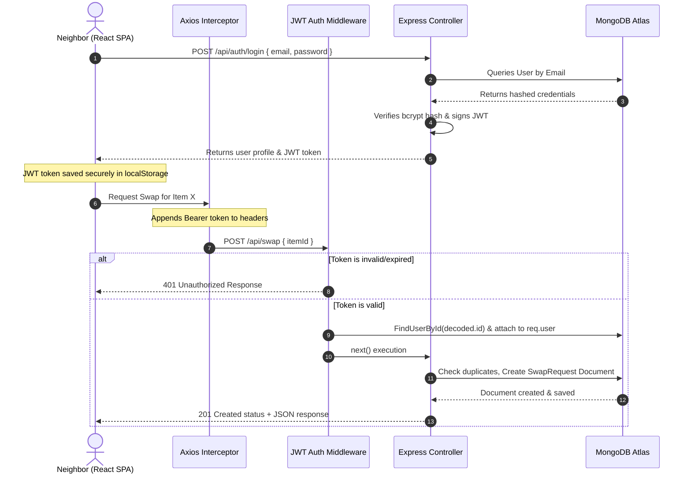

# 🌿 SwapNShare

A sustainable, community-driven grocery and resource exchange platform built using the **MERN** stack. SwapNShare empowers local neighborhoods to reduce waste, list surplus food or household items, and seamlessly coordinate peer-to-peer swaps.

---

## ⚡ Tech Stack & Badges

[-blue?style=for-the-badge&logo=react&logoColor=61DAFB)](https://react.dev/)
[-green?style=for-the-badge&logo=node.js&logoColor=339933)](https://nodejs.org/)
[](https://www.mongodb.com/)
[](https://jwt.io/)
[](#styling)

---

## 📌 Table of Contents

1. [Key Features](#-key-features)
2. [System Architecture](#-system-architecture)
3. [Database Schema & Relationships](#-database-schema--relationships)
4. [API Reference & Payload Contract](#-api-reference--payload-contract)
5. [Directory Layout](#-directory-layout)
6. [Local Development Setup](#-local-development-setup)
7. [Design Patterns & Security Principles](#-design-patterns--security-principles)
8. [Future Enhancements](#-future-enhancements)
9. [License & Contact](#-license--contact)

---

## ✨ Key Features

*   **🔒 Secure User Authentication**: Sign up and login workflows powered by salted and hashed passwords using `bcryptjs`, generating cryptographically signed `JWT` tokens.
*   **🛒 Neighborhood Marketplace**: A real-time dashboard displaying available goods, sorted in chronological order of sharing.
*   **📦 Inventory & Sharing Controls**: Easily post items for sharing with descriptive tags. Built-in permission check allows deletion of items only by their respective owner.
*   **🤝 Interactive Swap Workflow**:
    *   Initiate peer-to-peer swap requests.
    *   Built-in logic preventing duplicate requests or requesting your own item.
    *   Dedicated dashboard for managing incoming and outgoing requests (Accept/Reject options).
*   **📱 Responsive Interface**: Custom, device-agnostic CSS layouts with smooth transitions, modern typography, and responsive grid layouts.

---

## 🏛️ System Architecture

The project leverages a decoupled client-server architecture with state management and authentication hooks. Below is the workflow demonstrating a typical request cycle:



---

## 🗃️ Database Schema & Relationships

The MongoDB database is configured with strict Mongoose validation schemas, referencing models to establish clear entity relationships.

### 1. `User` Schema
Represents the application’s registered users.

| Field | Type | Rules / Validations | Description |
| :--- | :--- | :--- | :--- |
| `_id` | ObjectId | Auto-generated | Primary Key |
| `name` | String | Required (trimmed) | User's full name |
| `email` | String | Required, Unique, Lowercase, Trimmed | Unique login email |
| `password` | String | Required, Min length: 6 | Hashed password credential |
| `createdAt` | Date | Auto-generated timestamp | Record creation date |
| `updatedAt` | Date | Auto-generated timestamp | Record update date |

### 2. `Item` Schema
Represents items listed by users for exchange.

| Field | Type | Rules / Validations | Description |
| :--- | :--- | :--- | :--- |
| `_id` | ObjectId | Auto-generated | Primary Key |
| `title` | String | Required (trimmed) | Item name / title |
| `description`| String | Required (trimmed) | Details, expiry status, or conditions |
| `owner` | ObjectId | Required, `ref: 'User'` | Foreign Key referring to the creator |
| `createdAt` | Date | Auto-generated timestamp | Record creation date |

### 3. `SwapRequest` Schema
Represents exchange transactions between two neighbors.

| Field | Type | Rules / Validations | Description |
| :--- | :--- | :--- | :--- |
| `_id` | ObjectId | Auto-generated | Primary Key |
| `fromUser` | ObjectId | Required, `ref: 'User'` | Neighbor proposing the swap |
| `toUser` | ObjectId | Required, `ref: 'User'` | Neighbor who owns the listing |
| `itemId` | ObjectId | Required, `ref: 'Item'` | Listing being requested |
| `status` | String | Enum: `['pending', 'accepted', 'rejected']` | Request status (default: `pending`) |
| `createdAt` | Date | Auto-generated timestamp | Record creation date |

---

## 🔌 API Reference & Payload Contract

All API communications occur over JSON payloads. Headers must contain `Content-Type: application/json`. Protected endpoints require an `Authorization` header formatted as: `Bearer <JWT_TOKEN>`.

### Authentication Endpoints

#### `POST /api/auth/register`
*   **Access**: Public
*   **Request Body**:
    ```json
    {
      "name": "Jane Doe",
      "email": "jane@example.com",
      "password": "strongpassword123"
    }
    ```
*   **Response (201 Created)**:
    ```json
    {
      "message": "Registration successful",
      "token": "eyJhbGciOiJIUzI1NiIsIn...",
      "user": {
        "id": "60d0fe4f5311236168a109a1",
        "name": "Jane Doe",
        "email": "jane@example.com"
      }
    }
    ```

#### `POST /api/auth/login`
*   **Access**: Public
*   **Request Body**:
    ```json
    {
      "email": "jane@example.com",
      "password": "strongpassword123"
    }
    ```
*   **Response (200 OK)**:
    ```json
    {
      "message": "Login successful",
      "token": "eyJhbGciOiJIUzI1NiIsIn...",
      "user": {
        "id": "60d0fe4f5311236168a109a1",
        "name": "Jane Doe",
        "email": "jane@example.com"
      }
    }
    ```

### Items Endpoints

#### `GET /api/items`
*   **Access**: Public (displays all shared listings in reverse-chronological order)
*   **Response (200 OK)**:
    ```json
    [
      {
        "_id": "60d0fe4f5311236168a109b5",
        "title": "Fresh Organic Spinach",
        "description": "Unopened, freshly bought from farmers market. Best before tomorrow.",
        "owner": {
          "_id": "60d0fe4f5311236168a109a1",
          "name": "Jane Doe",
          "email": "jane@example.com"
        },
        "createdAt": "2026-08-28T09:00:00.000Z",
        "updatedAt": "2026-08-28T09:00:00.000Z"
      }
    ]
    ```

#### `POST /api/items`
*   **Access**: Protected
*   **Request Body**:
    ```json
    {
      "title": "Canned Peach Slices",
      "description": "Stored in cold cellar, expires in 2027"
    }
    ```
*   **Response (201 Created)**: Returns the newly created item populated with the current user's profile details.

#### `DELETE /api/items/:id`
*   **Access**: Protected (restricted to owner of the item)
*   **Response (200 OK)**:
    ```json
    {
      "message": "Item deleted successfully"
    }
    ```

### Swap Requests Endpoints

#### `POST /api/swap`
*   **Access**: Protected (checks that recipient is not the sender and no pending duplicate request exists)
*   **Request Body**:
    ```json
    {
      "itemId": "60d0fe4f5311236168a109b5"
    }
    ```
*   **Response (201 Created)**:
    ```json
    {
      "message": "Swap request sent!",
      "swapRequest": {
        "fromUser": "60d0fe4f5311236168a109a2",
        "toUser": "60d0fe4f5311236168a109a1",
        "itemId": "60d0fe4f5311236168a109b5",
        "_id": "60d0fe4f5311236168a109c3",
        "status": "pending",
        "createdAt": "2026-08-28T09:50:00.000Z",
        "updatedAt": "2026-08-28T09:50:00.000Z"
      }
    }
    ```

#### `GET /api/swap/my`
*   **Access**: Protected
*   **Response (200 OK)**: Returns lists of requests sent by the logged-in user, and requests received by them.
    ```json
    {
      "sent": [
        {
          "_id": "60d0fe4f5311236168a109c3",
          "itemId": {
            "_id": "60d0fe4f5311236168a109b5",
            "title": "Fresh Organic Spinach",
            "description": "Unopened, freshly bought from farmers market. Best before tomorrow."
          },
          "toUser": {
            "_id": "60d0fe4f5311236168a109a1",
            "name": "Jane Doe",
            "email": "jane@example.com"
          },
          "status": "pending",
          "createdAt": "2026-08-28T09:50:00.000Z"
        }
      ],
      "received": []
    }
    ```

#### `PUT /api/swap/:id`
*   **Access**: Protected (restricted to the recipient `toUser`)
*   **Request Body**:
    ```json
    {
      "status": "accepted" 
    }
    ```
    *(Note: Valid status values are only `"accepted"` or `"rejected"`)*
*   **Response (200 OK)**: Status updated successfully, returns the updated request model.

---

## 📁 Directory Layout

This project is organized into structured client (React SPA) and server (Express/Mongoose API) codebases.

```
swapnshare/
├── server/                     # Node.js + Express backend
│   ├── config/                 # Configurations (e.g., db)
│   ├── controllers/            # Controller layer (handles request logic)
│   │   ├── authController.js
│   │   ├── itemController.js
│   │   └── swapController.js
│   ├── middleware/             # Route authentication guards
│   │   └── authMiddleware.js
│   ├── models/                 # Database schema blueprints
│   │   ├── User.js
│   │   ├── Item.js
│   │   └── SwapRequest.js
│   ├── routes/                 # Express API Endpoint definitions
│   │   ├── authRoutes.js
│   │   ├── itemRoutes.js
│   │   └── swapRoutes.js
│   ├── .env                    # System Environment Variables (Ignored in Git)
│   ├── package.json            # Node backend dependencies & start scripts
│   └── server.js               # Express application entrypoint
│
└── client/                     # React + Vite frontend SPA
    ├── src/
    │   ├── components/         # Reusable UI Blocks (Navbar, etc.)
    │   │   └── Navbar.jsx
    │   ├── pages/              # Routed view templates
    │   │   ├── Home.jsx        # Landing dashboard
    │   │   ├── AddItem.jsx     # Sharing list form
    │   │   ├── MyRequests.jsx  # Transaction hub (Sent/Received requests)
    │   │   ├── Login.jsx       # Secure Login
    │   │   └── Register.jsx    # Account registration
    │   ├── utils/              # Utility helpers
    │   │   └── api.js          # Pre-configured Axios instance with Interceptors
    │   ├── App.jsx             # React router configuration
    │   ├── main.jsx            # DOM entrypoint
    │   └── index.css           # Global custom typography and theme variable definitions
    ├── index.html              # HTML core shell
    ├── vite.config.js          # Build configuration (contains proxy config)
    └── package.json            # Client packages & scripts
```

---

## 🚀 Local Development Setup

To run this project locally, execute the following configuration steps:

### Prerequisites
- Install [Node.js](https://nodejs.org) (v18 or higher recommended).
- Have a running [MongoDB Atlas Database](https://mongodb.com/atlas) or a local MongoDB server installation.

### Step 1 — Setup Database
1. Create a free Cluster on MongoDB Atlas.
2. Under **Database Access**, create a user with read/write privileges.
3. Under **Network Access**, whitelist connections from your IP address (or `0.0.0.0/0` for testing).
4. Click **Connect** → **Drivers** and copy your MongoDB connection URI.

### Step 2 — Configure Environment Settings
Inside `server/`, create a `.env` file and define the following variables:
```env
PORT=5000
MONGO_URI=mongodb+srv://<username>:<password>@cluster.xxxx.mongodb.net/swapnshare?retryWrites=true&w=majority
JWT_SECRET=add_a_very_secure_long_secret_key_here
```

### Step 3 — Install & Run Backend Server
In your terminal, navigate to the backend folder, install dependencies, and start the development server:
```bash
cd server
npm install
npm run dev
```
Wait for confirmation:
```text
✅ MongoDB connected
🚀 Server running on http://localhost:5000
```

### Step 4 — Install & Run React Frontend
Open a **new terminal tab or window**, navigate to the client folder, and start Vite's local dev server:
```bash
cd client
npm install
npm run dev
```
Open [http://localhost:5173](http://localhost:5173) in your browser.

---

## 🛠️ Design Patterns & Security Principles

This codebase is built around modern developer standards, implementing patterns recruiters search for:

*   **Separation of Concerns (MVC Structure)**: Controllers handle application logic, models validate data constraints, and routes define exposure points.
*   **Axios HTTP Interceptors**: Frontend calls use custom Axios instances that intercept outgoing queries, automatically inject JWT bearer tokens from client local storage, and cleanly streamline responses.
*   **Middleware-Driven Route Protection**: Route access control is delegated to a decoupled `authMiddleware`. Protected backend handlers execute with the authenticated user data populated in `req.user`.
*   **Input Validation & Security Guardrails**:
    *   Mongoose schemas reject malformed strings (auto-trim, type matching, uniqueness controls).
    *   Passwords are encrypted utilizing **bcryptjs** (10 salt rounds) before persistence.
    *   Controllers reject invalid transaction sequences (e.g. users trading with themselves or updating others' lists).

---

## 🗺️ Future Enhancements

*   💬 **Real-time Chat**: Integrations with socket.io for direct message coordination.
*   📍 **Location Filtering**: Geolocation queries to locate items within specific radial distances.
*   📸 **Image Uploading**: Integration with cloud storages (e.g., Cloudinary or AWS S3) for listing photos.
*   ⭐ **Trust & Rating System**: Reviews and safety ratings to build neighborhood trust.

---

## 📄 License & Contact

Distributed under the MIT License. See `LICENSE` for details.

Developed with 💚 for sustainable neighborhood sharing. For questions, reach out to the project maintainer.
